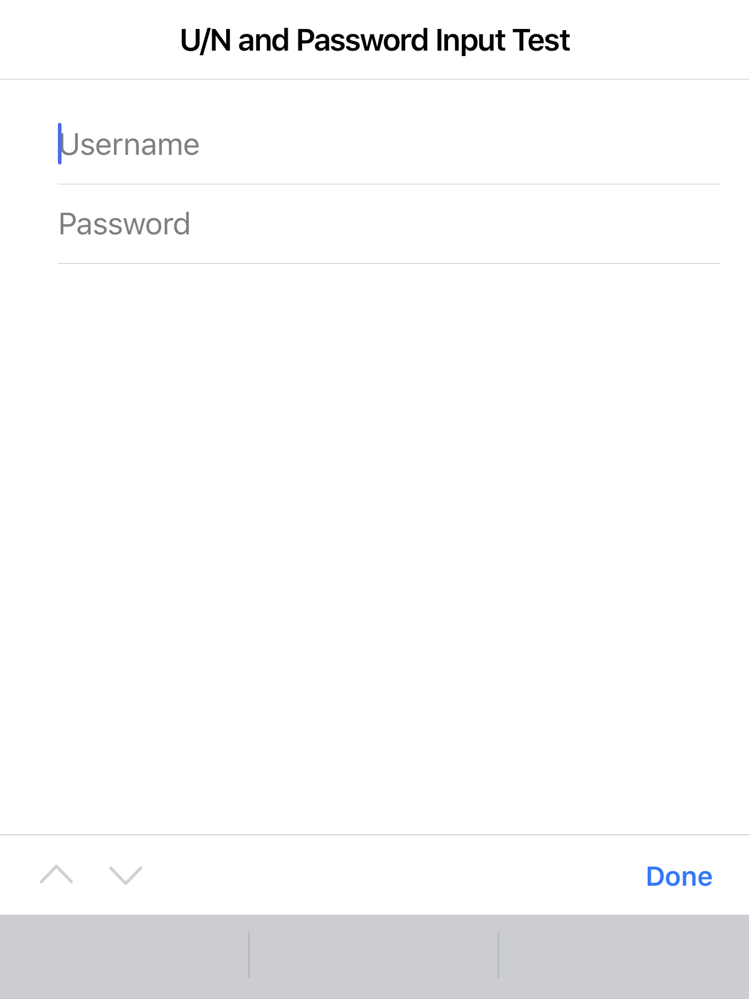

# Username and Password Autofill Reproduction

**Note**: These reproduction steps assume you have `npm`/`Node` installed on your machine as well as Xcode and a physical iOS device for testing.

## Running the Project

1. Download and unzip this project.
2. Run `npm install`
3. Run `ionic build`
4. Run `npx cap add ios`
5. Run `npx cap sync ios` (note: this step can take some time)
6. Run `npx cap open ios`
7. In Xcode, hit the Play button to run the application on your connected device (note that you will need to set the appropriate code signing credentials to do so)

## Reproducing the Current Behavior

### `master` branch
Once you have the application running on your iOS device:

1. Tap onto the username `ion-input` field
2. Notice that there is no option provided by the keyboard called "Passwords"

3. While the correct "Passwords" option is provided when tapping on the "Password" `ion-input`, selecting an entry in your password manager (either iOS Keychain or third party services like 1Password, LastPass, etc.) that *has* a username and password combination **will not** autofill the username entry field (password is correctly autofilled though).

This is due to the `ion-input` component being a child of `ion-item`/`ion-list`. See [this code](https://github.com/bryplano/UsernameRepro/blob/master/src/app/home/home.page.html#L12).

## Reproducing the Expected Behavior

Once you have the application running on your iOS device:

### `simple` branch

1. Tap onto the username `ion-input` field
2. Notice that **there is now an option** provided by the keyboard called "Passwords".

3. Selecting an entry in your password manager (either iOS Keychain or third party services like 1Password, LastPass, etc.) that *has* a username and password combination **will correctly** autofill both the username and password entry field.

Notice that in this case, `ion-input` is not a child of another Ionic component (outside of `ion-content`, which is fine).